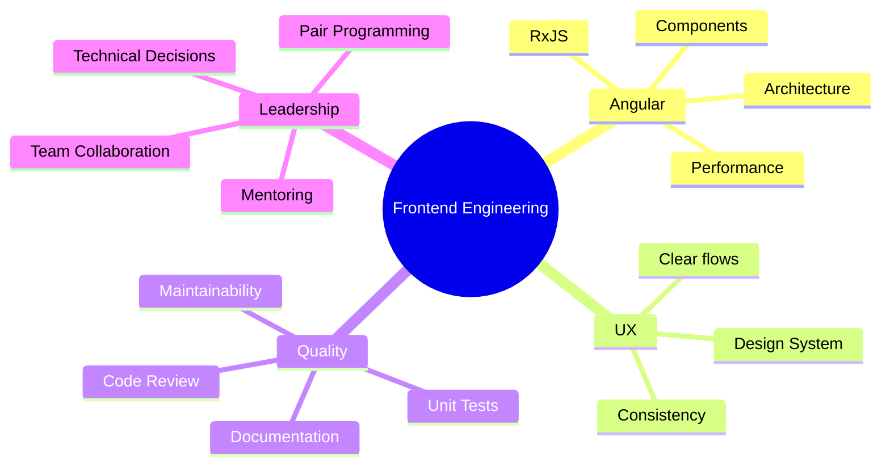

<!-- README.md | GitHub Profile | Maiara da Motta -->

<div align="center">


<br/>


<br/><br/>

<a href="#-english">🇺🇸 English</a> &nbsp;·&nbsp;
<a href="#-português">🇧🇷 Português</a> &nbsp;·&nbsp;
<a href="https://www.linkedin.com/in/maiara-motta">LinkedIn</a> &nbsp;·&nbsp;
<a href="mailto:maiaratais2010@gmail.com">Email</a>

</div>

---

## 🇺🇸 English

### About me

I'm **Maiara da Motta**, a **Senior Frontend Software Engineer** from Porto Alegre, Brazil, with **5+ years** focused on Angular, TypeScript and RxJS.

I specialize in enterprise-scale frontend systems — the kind where today's architecture decisions shape the product for years. Currently, I lead the migration of core interfaces from **Delphi to Angular** at Linx / TOTVS Linx, working at the intersection of legacy modernization, technical leadership and frontend craft.

> *Great frontend engineering is invisible to users and invaluable to teams.*

---

### ⚡ By the numbers

<div align="center">

| 5+ years | 2 products | 100+ components | 1 framework |
|:---:|:---:|:---:|:---:|
| in frontend engineering | modernized from Delphi | shipped to production | that I truly love |

</div>

---

### 🧩 Core expertise

<div align="center">

| Area | Technologies & practices |
|---|---|
| **Frontend** | Angular · TypeScript · JavaScript · RxJS · HTML · SCSS |
| **Architecture** | Componentization · Design Patterns · Clean Code · Frontend Architecture |
| **Quality** | Unit Testing · Jasmine · Karma · Code Review · Bug Fixing |
| **UX & Design** | Design Systems · UX Consistency · Interface Modernization |
| **Backend & Data** | PHP · Laravel · Symfony · MySQL · REST API Integration |
| **Leadership** | Technical Documentation · Mentoring · Pair Programming · Spec Writing |

</div>

---

### 🛠️ Tech stack

<div align="center">

**Primary**


**Also experienced with**


</div>

---

### 🚀 Where I've worked

**Senior Software Engineer · Linx / TOTVS Linx** *(current)*

Leading frontend development across enterprise applications, with focus on legacy modernization — migrating core interfaces from **Delphi to Angular**. I define technical approaches, write feature specs, evolve the frontend architecture, review Angular/TypeScript codebases and support the team through mentoring and code reviews.

**Software Engineer · TOTVS Linx**

Contributed to the technological transformation of large-scale systems by migrating interfaces to Angular, applying design patterns and frontend best practices to build reusable, scalable, high-quality software.

**Earlier roles**

E-commerce platforms · educational systems · API integrations · Shell Script automation · PHP ecosystems · signal and image processing research.

---

### 📌 How I build

```ts
// my engineering philosophy — committed to main

const principles = [
  "Understand the product goal before writing a single line",
  "Design structures that are simple today and safe to evolve tomorrow",
  "Keep components small, focused and honest about their responsibilities",
  "Use RxJS with clarity — not to be clever, but to be understood",
  "Review code with empathy: the author isn't wrong, they need context",
  "Document the decision, not just the outcome",
  "Build UX consistency as infrastructure, not as polish",
] as const;
```

---

## 🇧🇷 Português

### Sobre mim

Sou **Maiara da Motta**, **Engenheira de Software Frontend Sênior** de Porto Alegre, com **mais de 5 anos** focada em Angular, TypeScript e RxJS.

Especializada em sistemas frontend de escala corporativa — onde as decisões de arquitetura de hoje moldam o produto por anos. Atualmente, lidero a migração de interfaces core de **Delphi para Angular** na TOTVS Linx, atuando na interseção entre modernização de legado, liderança técnica e craft de frontend.

> *Engenharia frontend de excelência é invisível para usuários e inestimável para times.*

---

### ⚡ Em números

<div align="center">

| 5+ anos | 2 produtos | 100+ componentes | 1 framework |
|:---:|:---:|:---:|:---:|
| em engenharia frontend | modernizados do Delphi | entregues em produção | que realmente amo |

</div>

---

### 🧩 Especialidades

<div align="center">

| Área | Tecnologias e práticas |
|---|---|
| **Frontend** | Angular · TypeScript · JavaScript · RxJS · HTML · SCSS |
| **Arquitetura** | Componentização · Design Patterns · Clean Code · Arquitetura Frontend |
| **Qualidade** | Testes Unitários · Jasmine · Karma · Code Review · Correção de Bugs |
| **UX & Design** | Design Systems · Consistência de UX · Modernização de Interfaces |
| **Backend & Dados** | PHP · Laravel · Symfony · MySQL · Integração com APIs REST |
| **Liderança** | Documentação Técnica · Mentoria · Pair Programming · Especificação |

</div>

---

### 🛠️ Stack técnica

<div align="center">

**Principal**


**Também tenho experiência com**


</div>

---

### 🚀 Onde trabalhei

**Senior Software Engineer · Linx / TOTVS Linx** *(atual)*

Lidero o desenvolvimento frontend em aplicações corporativas, com foco em modernização de sistemas legados — migrando interfaces core de **Delphi para Angular**. Defino abordagens técnicas, escrevo especificações de funcionalidades, evoluo a arquitetura frontend, reviso codebases em Angular/TypeScript e apoio o time com mentoria e code reviews.

**Software Engineer · Linx / TOTVS Linx**

Contribuí para a transformação tecnológica de sistemas de grande escala, migrando interfaces para Angular e aplicando design patterns e boas práticas para entregar software reutilizável, escalável e de alta qualidade.

**Experiências anteriores**

Plataformas de e-commerce · sistemas educacionais · integrações com APIs · automações com Shell Script · ecossistemas PHP · pesquisa em processamento de sinais e imagens.

---

### 📌 Como eu construo

```ts
// minha filosofia de engenharia — commitada na main

const principios = [
  "Entender o objetivo do produto antes de escrever uma linha sequer",
  "Desenhar estruturas simples hoje e seguras para evoluir amanhã",
  "Manter componentes pequenos, focados e honestos sobre suas responsabilidades",
  "Usar RxJS com clareza — não para parecer inteligente, mas para ser compreendida",
  "Revisar código com empatia: a autora não está errada, ela precisa de contexto",
  "Documentar a decisão, não só o resultado",
  "Construir consistência de UX como infraestrutura, não como acabamento",
] as const;
```

---

### 💼 Professional focus



---

## 🌱 Currently interested in / Interesses atuais

- Advanced Angular architecture / Arquitetura Angular avançada
- Performance optimization / Otimização de performance
- Design Systems and UX consistency / Design Systems e consistência de UX
- Spec-driven development / Desenvolvimento guiado por especificação
- AI-assisted software development / Desenvolvimento com apoio de IA
- International frontend projects / Projetos frontend internacionais

---

## 🤝 Let's connect

<div align="center">

[](https://www.linkedin.com/in/maiara-motta)
[](mailto:maiaratais2010@gmail.com)
[](https://github.com/maiaratais2010)

<br/>


</div>
